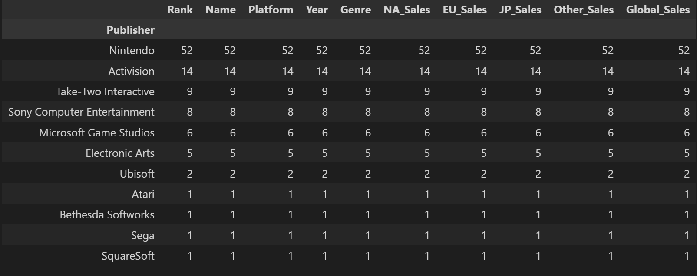
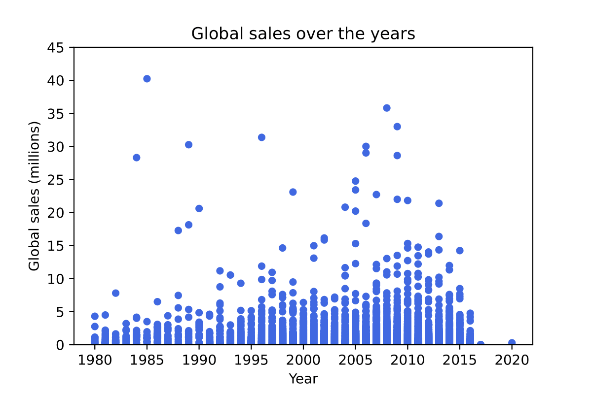
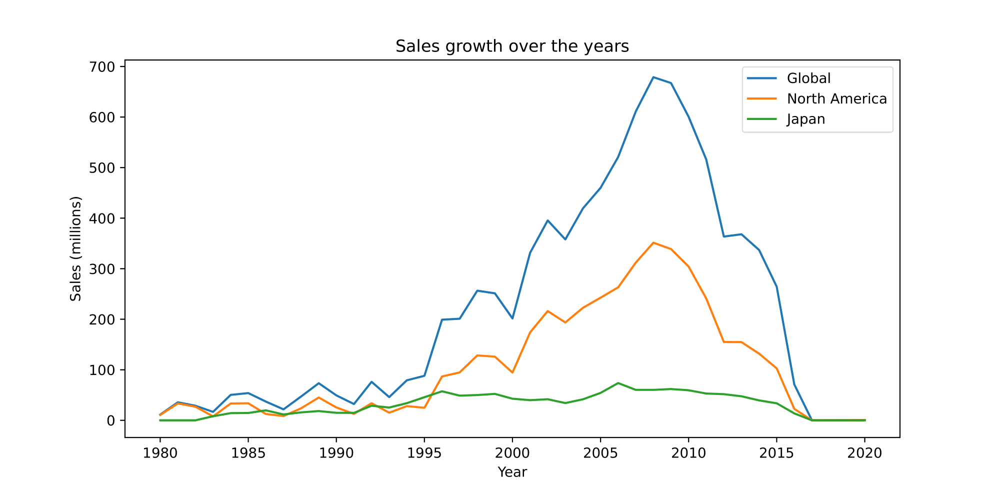
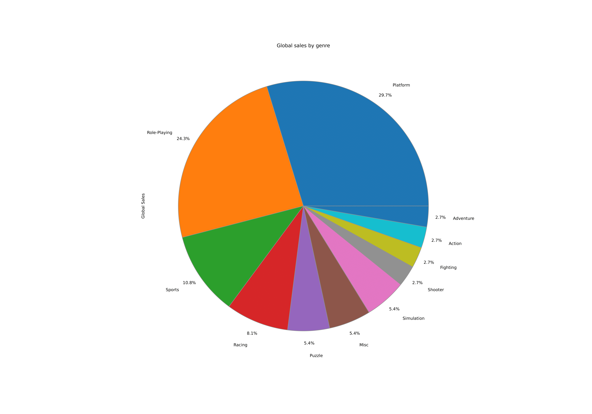
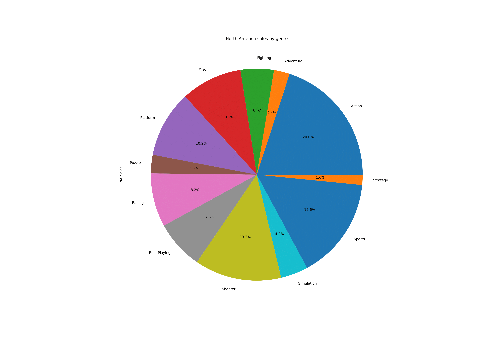
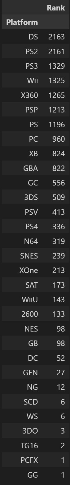
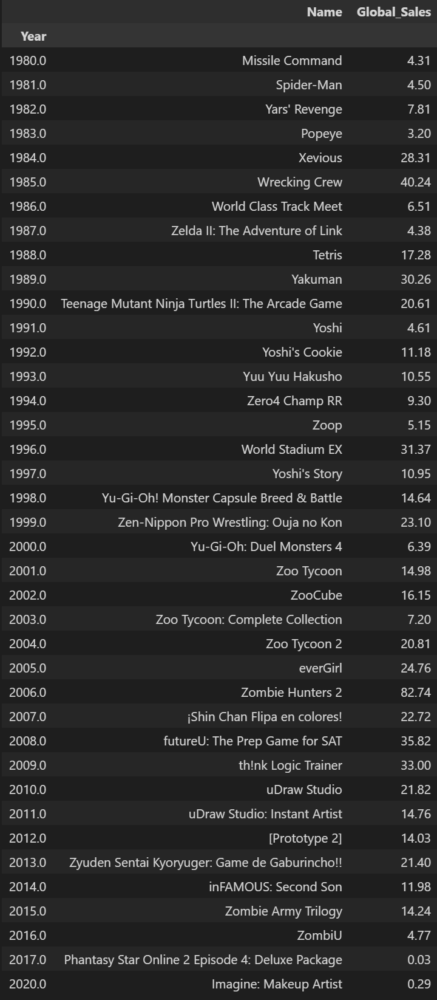

## Introduction
Being the gamer I am, I've always been curious about the statistics on video game sales. I've seen old gaming magazines on retro game prices at staggering $70 back in the 90s. Compared to the recent decade, video game price have remained relatively the same, excluding collector's editions. Therefore, I downloaded this data set on [Kaggle](kaggle.com) to analyze publisher, total sales, popularity in genre, and more.
## Questions

## Analysis

 
 
 
 
 
 
 

## Conclusion
